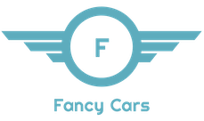

[![LiveApp][fancy-cars-shield]][fancy-cars-url]
[![LinkedIn][linkedin-shield]][linkedin-url]

<br />
<p align="center">
  <a href="http://localhost:3000">
    
  </a>

  <p align="center">
    A react app built on top of <b>NextJS</b>
    <br />
    <a href="https://nextjs.org/docs"><strong>Explore the docs »</strong></a>
    <br />
    <br />
    <a href="https://fancy-cars.jcastellanos003.now.sh/">View Live</a>
    ·
    <a href="https://github.com/jcastellanos003/fancy-cars/issues">Report Bug</a>
    ·
    <a href="https://github.com/jcastellanos003/fancy-cars/pulls">Request Feature</a>
  </p>
</p>

## Table of Contents

- [Table of Contents](#table-of-contents)
- [About The Project](#about-the-project)
  - [Built With](#built-with)
  - [Considerations](#considerations)
- [Getting Started](#getting-started)
  - [Installation](#installation)
  - [Tests](#tests)
- [Usage](#usage)
- [Contact](#contact)


## About The Project

[![Product Name Screen Shot][product-screenshot]](http://localhost:3000)

I decided to go with NextJS since one of the steps about the hiring process is an interview related to React Native, and as you may know, NextJS is SSR app which could narrow down the gap between a WebApp and a MobileApp.

Since I've been a lot in the angular world creating web apps and mobile apps using ionic, I'm aware of the "alternatives" like universal apps or PWAs to Hybrid o Native Mobile Apps.

This was a beautiful challenge in many aspects, hope you enjoy the code as much as I did when coding it. Cheers.

### Built With
* [NextJS](https://nextjs.org)
* [json-server](https://github.com/typicode/json-server)

### Considerations
* The app is full responsive
* There is a [live version](https://fancy-cars.jcastellanos003.now.sh/)
* The first load of the `live version` is slow because the API services are hosted on a free Heroku server

## Getting Started

To get a local copy up and running, follow these simple steps.

### Installation

1. Clone the repo
```sh
git clone https://github.com/jcastellanos003/fancy-cars.git
```
2. Install NPM packages
```sh
npm install
```
3. Run the app
```sh
npm start
```
### Tests

1. Unit tests
```sh
npm test
```

## Usage

Go to [localhost:3000](http://localhost:3000) and enjoy :)

## Contact

Julian Castellanos - jcastellanos003@gmail.com - +57 3502213760

[linkedin-shield]: https://img.shields.io/badge/-LinkedIn-black.svg?style=flat-square&logo=linkedin&colorB=555
[linkedin-url]: https://www.linkedin.com/in/julian-castellanos-1b1262b0/
[fancy-cars-shield]: https://img.shields.io/badge/live-fancy--cars-green
[fancy-cars-url]: https://fancy-cars.jcastellanos003.now.sh/
[product-screenshot]: docs/app-browser.png
